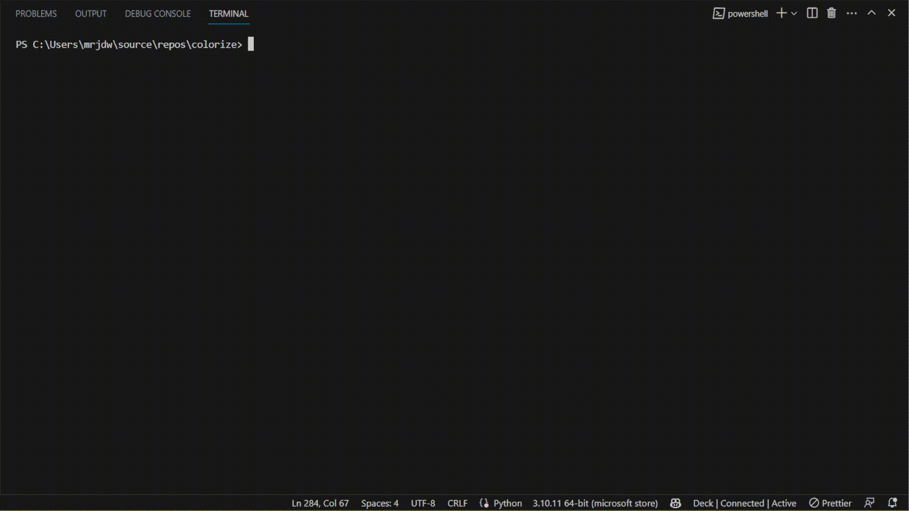
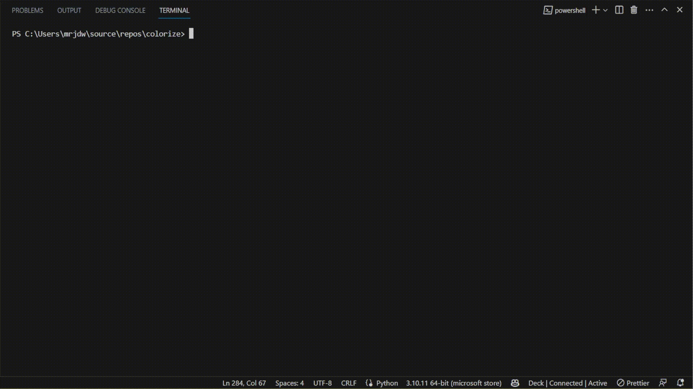

# colorize
***Not meant for public use***
## What is it?
This is a personal utility script for colorizing images in bulk. Very, very rough around the edges 
and not meant for public use. It can be used to colorize images using duotone, grayscale, or
hue shift. You can choose to replace the original files or save the colorized images as
new files. If you choose to use duotone, you can either enter a valid hex color or use the
`*` character to generate all 96 colors. If you choose to use hue shift, you can either enter
a valid angle or use the `-1` characters to generate all 360 angles (in increments of 10 degrees).
If you choose to use grayscale, the script will simply convert the images to grayscale.
The script will also print out the name of each file as it is colorized and saved.
## Example Usage
### Hue Shift Example

### Duotone Example

### Grayscale Example

---
### Notes
* This script only works on .png files currently, but could be modified pretty easily for other image types as well.
* Big thanks to the duotone library from [here](https://github.com/carloe/duotone-py)
* This was something thrown together quickly to avoid paying a website money to do multiple files.
The examples show it going through images incredibly quickly, but yours will probably take much longer since
the photos used were only 72px by 72px. This could be optimized by using multithreading or maybe libraries to
do the image manipulation with a faster programing language.
